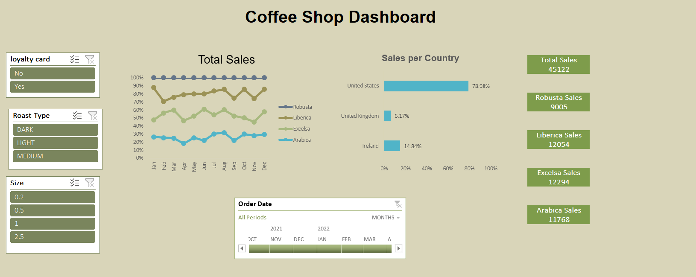

# ☕ Coffee Shop Sales Dashboard

## Overview

This project showcases an interactive Coffee Shop Sales Dashboard built using Microsoft Excel to demonstrate practical skills in data analysis, dashboard development, and business reporting.

## Dashboard Features
- Sales Performance Analysis
- Product Performance Analysis
- Customer Insights
- Country-wise Sales Analysis
- Interactive Filters (Slicers)

## Tools & Technologies
- Microsoft Excel
- Power Query
- Pivot Tables
- Pivot Charts
- Data Visualization

## Skills Demonstrated
- Data Cleaning
- Data Transformation
- Dashboard Development
- Business Intelligence
- Data Analysis

## Files
- Coffee Shop Sales Dashboard.xlsx
- Dashboard Screenshot

## Author
**Bisma Iftikhar**  
Excel & Power BI Analyst | Dashboard Developer
